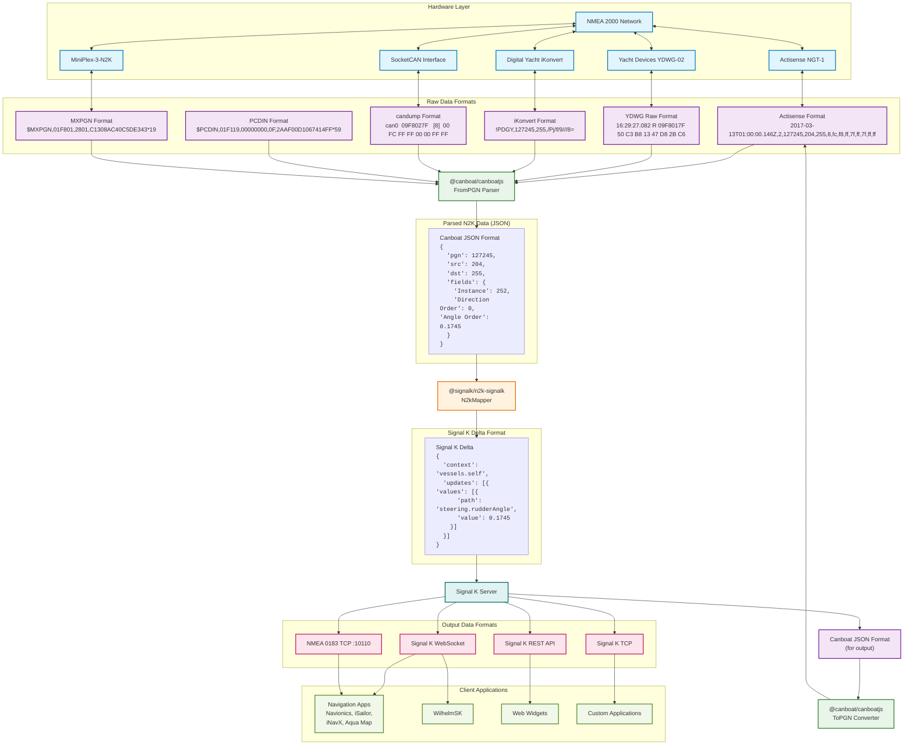

# Architecture Diagram: canboatjs, n2k-signalk, and signalk-server Integration

## Overview
This diagram shows how the three main components work together to process marine data from NMEA 2000 devices to Signal K format and beyond.

## Data Flow Explanation

### 1. **Hardware Layer**
- **NMEA 2000 Network**: Marine electronics network using CAN bus protocol
- **Gateways**: Various hardware devices that bridge NMEA 2000 to serial/ethernet/wifi
- **Interfaces**: Direct CAN bus interfaces for Linux systems

### 2. **canboatjs (@canboat/canboatjs)**
**Purpose**: Parse and encode NMEA 2000 data in various formats
- **FromPgn Parser**: Core parser that converts various N2K formats to standardized JSON

**Key Features**:
- Multi-format input support (Actisense, YDWG, iKonvert, etc.)
- Real-time stream processing
- Bidirectional conversion (parse and generate)
- Hardware abstraction layer

### 3. **n2k-signalk (@signalk/n2k-signalk)**
**Purpose**: Convert parsed NMEA 2000 JSON to Signal K delta format
- **N2kMapper**: Main conversion engine
- **PGN Mappings**: Manufacturer-specific and standard PGN definitions
- **Delta Converter**: Transforms N2K data to Signal K delta updates

**Key Features**:
- Comprehensive PGN coverage
- Manufacturer-specific extensions
- Signal K delta format output
- Custom mapping support

### 4. **signalk-server**
**Purpose**: Central hub for marine data processing and distribution
- **Stream Processors**: Handle different data types and formats
- **Data Providers**: Connect to various data sources
- **Plugin System**: Extensible architecture for custom functionality
- **Network Interfaces**: Serve data via HTTP, WebSocket, TCP, etc.

**Key Features**:
- Multi-protocol support (NMEA 2000, NMEA 0183, Signal K)
- Web-based administration interface
- Plugin ecosystem for extensions
- Real-time data streaming
- Format conversion and bridging

## Integration Points

### **canboatjs → n2k-signalk**
- canboatjs parses raw N2K data into standardized JSON format
- n2k-signalk consumes this JSON and converts it to Signal K deltas
- Both libraries share common PGN definitions from @canboat/ts-pgns

### **n2k-signalk → signalk-server**
- signalk-server uses n2k-signalk as a stream processor
- N2K data flows through canboatjs → n2k-signalk → Signal K deltas
- Server maintains device metadata and manages data flow

## Output Capabilities

### **Data Formats**
- **Signal K**: Native JSON format via WebSocket and REST APIs
- **NMEA 0183**: Converted output via TCP for legacy applications
- **NMEA 2000**: Bidirectional N2K communication

### **Client Applications**
- **Navigation Apps**: Navionics, iSailor, iNavX, Aqua Map via NMEA 0183 TCP
- **Signal K Apps**: WilhelmSK and custom applications via Signal K APIs
- **Web Applications**: Browser-based instruments and controls
- **Custom Clients**: Direct API access for specialized applications

## Key Benefits

1. **Multi-Format Support**: Handle various proprietary formats from different manufacturers
2. **Real-Time Processing**: Stream-based architecture for live data
3. **Extensibility**: Plugin system and custom mappings
4. **Standardization**: Convert proprietary formats to open Signal K standard
5. **Bridging**: Connect legacy NMEA 0183 apps to modern NMEA 2000 networks
6. **Device Integration**: Support for multiple hardware interfaces and protocols
